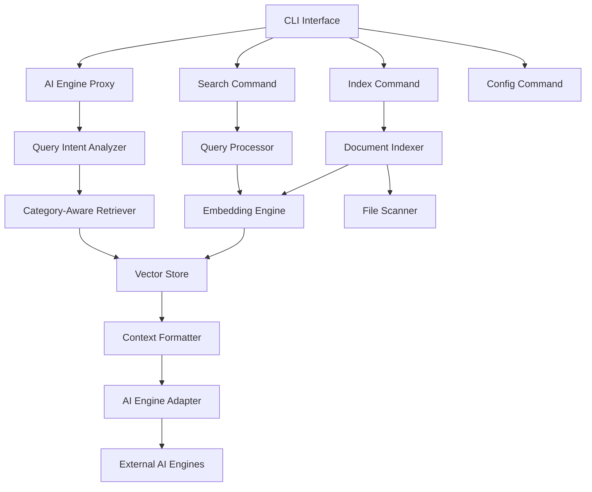
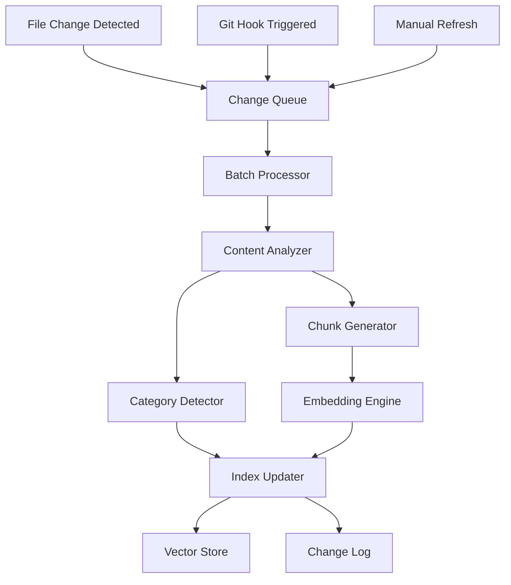
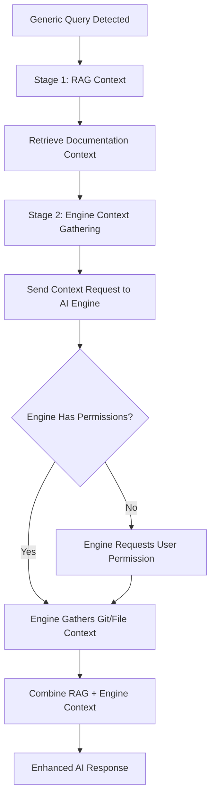

# Design Document

## Overview

The CLI RAG Helper transforms handoff-ai into an intelligent AI assistant proxy with automatic context enhancement. The system uses category-aware semantic search to intelligently retrieve relevant project documentation and combines it with user queries before sending to AI engines. This design leverages lightweight, local embedding models and smart categorization to provide contextually-rich AI interactions without requiring external API calls for the RAG functionality.

## Architecture

### High-Level Architecture



### Core Components

1. **AI Engine Proxy** - Main interface for `handoff-ai --engine <engine> '<query>'` commands
2. **Query Intent Analyzer** - Classifies queries to determine needed document categories
3. **Category-Aware Retriever** - Intelligently selects context based on query intent
4. **Document Indexer** - Scans and categorizes project files by handoff-ai document types
5. **Embedding Engine** - Generates semantic embeddings using local models
6. **Vector Store** - Lightweight local storage for embeddings and category metadata
7. **AI Engine Adapter** - Formats and sends enhanced prompts to various AI engines
8. **Index Synchronizer** - Monitors file changes and maintains index synchronization
9. **Search Command Handler** - Direct search interface for manual context exploration

## CLI Alias Implementation

The system provides a convenient short alias `ha` for the full `handoff-ai` command:

### Package.json Configuration
```json
{
  "bin": {
    "handoff-ai": "bin/handoff.js",
    "ha": "bin/handoff.js"
  }
}
```

### Usage Examples
- `ha --engine codex 'help me add keyboard shortcuts'`
- `ha search "authentication patterns"`
- `ha init`
- `ha status`

Both `handoff-ai` and `ha` execute the same binary and provide identical functionality.

### Smart Command Parsing

The CLI intelligently handles different command patterns:

```bash
# Use default engine (requires configuration)
ha 'help me add keyboard shortcuts'

# Specify engine explicitly
ha --engine codex 'help me add keyboard shortcuts'
ha --engine claude 'review this code'

# Traditional commands still work
ha search "authentication patterns"
ha init
ha config
```

### Error Handling and User Guidance

```javascript
class ConfigurationError extends Error {
    constructor(message) {
        super(message);
        this.name = 'ConfigurationError';
        this.helpText = 'Run `ha config` to set up AI engines';
    }
}

class EngineNotAvailableError extends Error {
    constructor(message, availableEngines = []) {
        super(message);
        this.name = 'EngineNotAvailableError';
        this.availableEngines = availableEngines;
    }
}
```

## Components and Interfaces

### 1. AI Engine Proxy (`lib/ai-proxy/engine-proxy.js`)

```javascript
// Primary interface for AI engine integration
async function handleAIQuery(engineOrQuery, queryOrOptions, options = {}) {
    // Smart parameter handling:
    // handleAIQuery('query') -> use default engine
    // handleAIQuery('gpt-4', 'query') -> use specified engine
    
    const { engine, query } = await this.resolveEngineAndQuery(engineOrQuery, queryOrOptions);
    
    // Validate engine availability
    await this.validateEngine(engine);
    
    // Analyze query intent and retrieve relevant context
    // Combine context with user query
    // Send enhanced prompt to specified AI engine
}

async function resolveEngineAndQuery(param1, param2) {
    if (param2) {
        // Two parameters: engine specified
        return { engine: param1, query: param2 };
    } else {
        // One parameter: use default engine
        const defaultEngine = await this.getDefaultEngine();
        if (!defaultEngine) {
            throw new ConfigurationError('No default engine configured. Use `ha config` to set up engines.');
        }
        return { engine: defaultEngine, query: param1 };
    }
}

async function validateEngine(engine) {
    const availableEngines = await this.getAvailableEngines();
    if (!availableEngines.includes(engine)) {
        const message = `Engine '${engine}' is not available.\n\nAvailable engines: ${availableEngines.join(', ')}\n\nTo configure engines, run: ha config`;
        throw new EngineNotAvailableError(message);
    }
}
```

**Key Features:**
- Smart parameter detection (`ha 'query'` vs `ha --engine gpt-4 'query'`)
- Default engine configuration and fallback
- Helpful error messages for missing/invalid engines
- Automatic context enhancement for AI queries
- Support for multiple AI engines (codex, claude, gpt-4, etc.)
- Category-aware context retrieval
- Intelligent prompt formatting per engine

### 2. Query Intent Analyzer (`lib/analysis/intent-analyzer.js`)

```javascript
class IntentAnalyzer {
    async analyzeQuery(query, context = {})
    async determineCategories(intent)
    async classifyQueryType(query)
    async detectContextNeeds(query)
    async gatherAdditionalContext(query, workingDirectory)
}
```

**Enhanced Context Detection:**
- Detects when queries are too generic ("help me debug this")
- **Delegates context gathering to AI engines** (engines handle their own permissions)
- Uses AI engine capabilities to scan for recent git changes and current directory context
- Combines AI engine responses with RAG-retrieved documentation
- **Graceful degradation**: Proceeds with available context when engines can't provide more details

**Categories Mapping:**
- Feature development → golden-path, design-principles, architecture
- Debugging/Issues → constraints, assumptions, troubleshooting + current directory files
- Code review → review-rules, design-principles, assumptions
- Architecture changes → architecture, constraints, design-principles

### 3. Search Command (`lib/commands/search.js`)

```javascript
// Direct search interface for manual exploration
async function searchCommand(query, options = {}) {
    // Handle search queries with contextual ranking
    // Options: --count, --format, --copy, --context, --category
}
```

**Key Features:**
- Natural language query processing
- Category-specific search options
- Multiple output formats (console, clipboard, AI-ready)
- Integration with existing handoff-ai workflow

### 4. Document Indexer (`lib/indexer/document-indexer.js`)

```javascript
class DocumentIndexer {
    async scanProject(rootPath, config)
    async indexFile(filePath, content, category)
    async categorizeDocument(filePath, content)
    async updateIndex(changedFiles)
    async getIndexStats()
}
```

**Responsibilities:**
- Scan project directories for indexable content
- Automatically categorize documents by handoff-ai types
- Extract text content from various file types
- Generate embeddings for document chunks with category metadata
- Maintain index metadata and statistics

**Document Categories:**
- design-principles, golden-path, architecture, constraints
- assumptions, review-rules, bdd-features, epics
- README, documentation, code files

### 3. Embedding Engine (`lib/embeddings/embedding-engine.js`)

```javascript
class EmbeddingEngine {
    async initialize(modelConfig)
    async generateEmbedding(text)
    async generateBatch(textArray)
    async similarity(embedding1, embedding2)
}
```

**Implementation Strategy:**
- Use lightweight local models (e.g., all-MiniLM-L6-v2 via @xenova/transformers)
- Support for both CPU and GPU acceleration where available
- Batch processing for efficient indexing
- Configurable model selection based on performance needs

### 4. Vector Store (`lib/storage/vector-store.js`)

```javascript
class VectorStore {
    async store(id, embedding, metadata)
    async search(queryEmbedding, limit, filters)
    async update(id, embedding, metadata)
    async delete(id)
    async getStats()
}
```

**Storage Strategy:**
- SQLite database for metadata and small embeddings
- Category-based indexing for efficient retrieval
- Efficient similarity search using cosine similarity
- Incremental updates to avoid full re-indexing

### 8. AI Engine Adapter (`lib/ai-engines/engine-adapter.js`)

```javascript
class AIEngineAdapter {
    async sendToEngine(engine, enhancedPrompt, options)
    async formatPromptForEngine(engine, context, query)
    async configureEngine(engine, apiKey, settings)
}
```

**Supported Engines:**
- OpenAI (GPT-4, GPT-3.5, Codex)
- Anthropic (Claude)
- Local models (Ollama, etc.)
- Custom API endpoints

**Engine-Specific Formatting:**
- Context placement optimization per engine
- Token limit management
- Engine-specific prompt templates

### 9. Index Synchronizer (`lib/sync/index-synchronizer.js`)

```javascript
class IndexSynchronizer {
    async startWatching(paths, options)
    async processFileChange(filePath, changeType)
    async installGitHooks()
    async processGitChanges(changedFiles)
    async validateIndexIntegrity()
}
```

**Synchronization Features:**
- Real-time file system monitoring
- Git hook integration for commit/merge triggers
- Intelligent change detection with content hashing
- Batch processing for performance optimization
- Automatic recovery from index corruption

### 6. Category-Aware Retriever (`lib/retrieval/category-retriever.js`)

```javascript
class CategoryRetriever {
    async retrieveByIntent(query, intent, categories, contextualInfo = {})
    async retrieveByCategory(categories, limit)
    async combineContextFromCategories(results)
    async enhanceWithEngineContext(query, engineResponse)
    async delegateContextGathering(query, engine)
    async detectGenericQueries(query)
}
```

**Enhanced Retrieval Strategy:**
- Intent-based category selection
- **Delegated context gathering** (AI engines handle git/filesystem access with their own permissions)
- **Engine response integration** (combine AI engine context with RAG documentation)
- **Generic query detection** ("help me debug this" → delegate to engine for current context)
- **Graceful fallback strategy** (proceed with available context when engines can't provide more)
- **Multi-stage enhancement** (RAG context + engine context = comprehensive response)
- Weighted retrieval across multiple categories
- Smart context combination with attribution

### 7. Query Processor (`lib/search/query-processor.js`)

```javascript
class QueryProcessor {
    async processQuery(query, context, categories)
    async rankResults(results, context, categoryWeights)
    async applyFilters(results, filters)
}
```

**Ranking Factors:**
- Semantic similarity score (primary)
- Category relevance weight
- File recency (git modification time)
- Directory proximity to current working directory
- Handoff-ai documentation priority boost

## Data Models

### Document Index Entry

```javascript
{
    id: "unique-file-id",
    filePath: "relative/path/to/file.md",
    fileName: "file.md",
    fileType: "markdown",
    category: "design-principles", // handoff-ai document category
    lastModified: "2024-01-15T10:30:00Z",
    size: 1024,
    chunks: [
        {
            chunkId: "chunk-1",
            content: "text content of chunk",
            startLine: 1,
            endLine: 50,
            embedding: [0.1, 0.2, ...], // 384-dimensional vector
            category: "design-principles",
            metadata: {
                headings: ["Introduction", "Setup"],
                codeBlocks: 2,
                links: 3,
                intentRelevance: {
                    "feature-development": 0.9,
                    "debugging": 0.3,
                    "architecture": 0.8
                }
            }
        }
    ],
    metadata: {
        isHandoffDoc: true,
        category: "design-principles",
        directory: ".project/",
        gitStatus: "modified",
        language: "en"
    }
}
```

### Search Result

```javascript
{
    document: DocumentIndexEntry,
    chunk: ChunkData,
    score: 0.85,
    relevanceFactors: {
        semanticSimilarity: 0.82,
        recencyBoost: 0.05,
        proximityBoost: 0.03,
        typeBoost: 0.02
    },
    excerpt: "highlighted text excerpt...",
    context: {
        beforeLines: ["line before match"],
        afterLines: ["line after match"]
    }
}
```

### Configuration Schema

```javascript
{
    aiEngines: {
        default: "gpt-4", // Default engine for `ha 'query'` commands
        engines: {
            "gpt-4": {
                provider: "openai",
                apiKey: "sk-...",
                model: "gpt-4",
                maxTokens: 4000,
                contextTokens: 3000,
                enabled: true
            },
            "claude": {
                provider: "anthropic",
                apiKey: "sk-ant-...",
                model: "claude-3-sonnet",
                maxTokens: 4000,
                contextTokens: 3000,
                enabled: true
            },
            "codex": {
                provider: "openai",
                apiKey: "sk-...",
                model: "code-davinci-002",
                maxTokens: 2000,
                contextTokens: 1500,
                enabled: false // Disabled if API key missing or invalid
            }
        }
    },
    indexing: {
        includePaths: [".project/", "docs/", "*.md", "README*"],
        excludePaths: ["node_modules/", ".git/", "*.log"],
        maxFileSize: "1MB",
        chunkSize: 500,
        chunkOverlap: 50,
        autoIndex: true,
        backgroundIndex: true
    },
    synchronization: {
        fileWatcher: {
            enabled: true,
            debounceMs: 1000,
            batchSize: 10
        },
        gitHooks: {
            enabled: true,
            installOnInit: true,
            hooks: ["post-commit", "post-merge", "post-checkout"]
        },
        updateStrategy: {
            incremental: true,
            contentHashing: true,
            backgroundProcessing: true,
            maxQueueSize: 100
        }
    },
    search: {
        defaultResultCount: 5,
        maxResultCount: 20,
        similarityThreshold: 0.3,
        contextLines: 2,
        categoryWeights: {
            "design-principles": 1.0,
            "golden-path": 1.0,
            "architecture": 0.9,
            "constraints": 0.8,
            "assumptions": 0.7
        }
    },
    embedding: {
        model: "all-MiniLM-L6-v2",
        dimensions: 384,
        batchSize: 32
    },
    storage: {
        indexPath: ".handoff-ai/index.db",
        cacheSize: "100MB"
    }
}
```

## Error Handling

### Graceful Degradation Strategy

1. **Missing Index**: Automatically trigger indexing on first search
2. **Embedding Model Issues**: Fall back to text-based search with fuzzy matching
3. **Corrupted Index**: Rebuild index automatically with user notification
4. **Large Files**: Skip files exceeding size limits with warning
5. **Permission Issues**: Skip inaccessible files and continue indexing

### Error Recovery

```javascript
class ErrorHandler {
    async handleIndexingError(error, filePath)
    async handleSearchError(error, query)
    async recoverCorruptedIndex()
    async fallbackToTextSearch(query)
}
```

## Testing Strategy

### Unit Tests

1. **Embedding Engine Tests**
   - Verify embedding generation consistency
   - Test batch processing efficiency
   - Validate similarity calculations

2. **Document Indexer Tests**
   - Test file scanning and filtering
   - Verify chunk generation logic
   - Test incremental update functionality

3. **Vector Store Tests**
   - Test CRUD operations
   - Verify search result accuracy
   - Test performance with large datasets

4. **Query Processor Tests**
   - Test ranking algorithm accuracy
   - Verify contextual boost calculations
   - Test filter application

### Integration Tests

1. **End-to-End Search Flow**
   - Index sample project
   - Perform various search queries
   - Verify result relevance and ranking

2. **CLI Integration**
   - Test all command-line options
   - Verify output formatting
   - Test clipboard integration

3. **Performance Tests**
   - Indexing speed with various project sizes
   - Search response time benchmarks
   - Memory usage optimization

### Test Data

- Sample documentation projects of varying sizes
- Real-world handoff-ai project configurations
- Edge cases: empty projects, large files, binary files
- Multi-language content for internationalization testing

## Performance Considerations

### Indexing Performance

- **Incremental Updates**: Only re-index changed files
- **Batch Processing**: Process multiple files in parallel
- **Memory Management**: Stream large files to avoid memory issues
- **Progress Feedback**: Show indexing progress for large projects

### Search Performance

- **Embedding Caching**: Cache embeddings for repeated queries
- **Result Caching**: Cache search results for identical queries
- **Lazy Loading**: Load full document content only when needed
- **Similarity Optimization**: Use approximate nearest neighbor for large indexes

### Storage Optimization

- **Compression**: Compress embeddings for storage efficiency
- **Pruning**: Remove outdated index entries automatically
- **Cleanup**: Provide commands to clean and optimize the index
- **Size Limits**: Configurable limits to prevent excessive storage usage

## Integration Points

### Existing Handoff-AI Commands

1. **Enhanced Start Command**: Include search capabilities in guidance
2. **Review Command Integration**: Suggest relevant docs during review
3. **Status Command**: Show index statistics and health
4. **Config Command**: Manage RAG-specific settings

### AI Assistant Integration

1. **Context Preparation**: Format search results for specific AI tools
2. **Clipboard Integration**: Easy copying of relevant context
3. **Export Formats**: Support for various AI assistant input formats
4. **Automatic Context**: Suggest relevant docs based on current activity

### File System Integration

1. **Git Integration**: Prioritize recently changed files
2. **Watch Mode**: Optional file watching for real-time index updates
3. **Workspace Awareness**: Boost relevance for current working directory
4. **Project Detection**: Automatically detect project boundaries

## Initialization Strategy

### Automatic Indexing Flow

1. **During `handoff-ai init`**:
   - Create `.handoff-ai/` directory for index storage
   - Begin background indexing of existing documentation
   - Show progress indicator for initial indexing
   - Complete initialization even if indexing is still running

2. **Background Processing**:
   - Index runs in background after init completes
   - User can immediately use other commands
   - Index status shown in `handoff-ai status`
   - Graceful handling if queries come before indexing completes

3. **Incremental Updates**:
   - File watcher detects changes to indexed files
   - Automatic re-indexing of modified files
   - Git hook integration for commit-time updates
   - Manual refresh with `handoff-ai index --refresh`

### User Experience

- **First Use**: `handoff-ai init` → automatic indexing begins
- **Immediate Use**: Can use AI proxy even during initial indexing
- **Fallback**: If no index exists, falls back to simple text search
- **Status**: `handoff-ai status` shows indexing progress and health

## Automatic Index Synchronization

### File Change Detection

The system maintains index synchronization through multiple mechanisms:

1. **File System Watcher**:
   - Monitors `.project/`, `docs/`, and other configured directories
   - Detects file modifications, additions, and deletions in real-time
   - Queues changes for batch processing to avoid excessive re-indexing

2. **Git Hook Integration**:
   - Installs git hooks during `handoff-ai init` (optional)
   - Triggers index updates on `post-commit`, `post-merge`, and `post-checkout`
   - Processes only files that changed in the git operation

3. **Manual Refresh**:
   - `handoff-ai index --refresh` for manual updates
   - `handoff-ai index --full-rebuild` for complete re-indexing
   - Automatic detection of index corruption with recovery

### Incremental Update Strategy



### Smart Update Logic

```javascript
class IndexSynchronizer {
    async processFileChange(filePath, changeType) {
        // changeType: 'modified', 'added', 'deleted'
        
        if (changeType === 'deleted') {
            await this.removeFromIndex(filePath);
            return;
        }
        
        const existingEntry = await this.getIndexEntry(filePath);
        const currentContent = await fs.readFile(filePath, 'utf8');
        const currentHash = this.hashContent(currentContent);
        
        // Skip if content hasn't actually changed
        if (existingEntry && existingEntry.contentHash === currentHash) {
            return;
        }
        
        // Re-categorize and re-index
        const category = await this.categorizeDocument(filePath, currentContent);
        const chunks = await this.generateChunks(currentContent);
        const embeddings = await this.generateEmbeddings(chunks);
        
        await this.updateIndexEntry(filePath, {
            category,
            chunks,
            embeddings,
            contentHash: currentHash,
            lastModified: new Date()
        });
    }
}
```

### Integration with AI Documentation Updates

When AI assistants update documentation (following handoff-ai prompts):

1. **Detection**: File watcher detects the documentation change
2. **Categorization**: System re-analyzes the updated content for category changes
3. **Incremental Update**: Only changed sections are re-embedded
4. **Validation**: System validates that the update maintains document structure
5. **Notification**: Optional notification that index has been updated

### Performance Optimization

- **Debouncing**: Multiple rapid changes are batched together
- **Content Hashing**: Skip re-indexing if content hash hasn't changed
- **Partial Updates**: Only re-embed changed chunks within a document
- **Background Processing**: Updates happen asynchronously without blocking user operations
- **Change Prioritization**: Recent changes get higher priority in the update queue

## Graceful Degradation Strategy

### Handling Insufficient Context

When users provide generic queries and can't offer more specific details:

```javascript
class ContextFallbackHandler {
    async handleInsufficientContext(query, availableContext) {
        // Strategy 1: Use best available context
        const generalContext = await this.gatherGeneralProjectContext();
        
        // Strategy 2: Provide helpful response with limitations noted
        const response = await this.generateResponseWithLimitations(query, generalContext);
        
        // Strategy 3: Suggest follow-up actions (optional, non-blocking)
        const suggestions = await this.generateFollowUpSuggestions(query);
        
        return {
            response,
            limitations: "Response based on general project context. For more specific help, try providing details about the specific file or error.",
            suggestions
        };
    }
}
```

### Fallback Context Sources

When specific context isn't available:

1. **General Project Documentation**: README, main docs, architecture overview
2. **Common Patterns**: Frequently accessed files and documentation
3. **Project Type Defaults**: Standard patterns for the detected project type
4. **Historical Context**: Previously successful query patterns

### User-Friendly Response Strategy

Instead of blocking for clarification, provide helpful responses:

```
✅ Good: "Based on your project structure, here are common debugging approaches for authentication issues... [helpful response with general context]

💡 Tip: For more specific help, you could try: 'help me debug login.js authentication error'"

❌ Avoid: "I need more information. Please specify which file and what error you're seeing."
```

**Key Principle**: Always try to be helpful with available context rather than blocking the user for more information.

## Delegated Context Gathering Strategy

### Two-Stage Enhancement Process

For generic queries like "help me debug this", the system uses a two-stage approach:



### Implementation Flow

```javascript
class DelegatedContextGatherer {
    async handleGenericQuery(query, engine) {
        // Stage 1: Get RAG context based on intent
        const ragContext = await this.retrieveDocumentationContext(query);
        
        // Stage 2: Delegate additional context gathering to AI engine
        const contextGatheringPrompt = this.buildContextGatheringPrompt(query);
        const engineContext = await this.sendToEngine(engine, contextGatheringPrompt);
        
        // Stage 3: Combine contexts and send final enhanced query
        const enhancedPrompt = this.combineContexts(query, ragContext, engineContext);
        return await this.sendToEngine(engine, enhancedPrompt);
    }
    
    buildContextGatheringPrompt(query) {
        return `The user asked: "${query}"
        
This is a generic query that needs more context. Please gather relevant information about:
- Recent git changes (if you have permission)
- Current working directory files
- Any error logs or console output
- Project structure context

Then provide a helpful response based on the context you can gather.`;
    }
}
```

### Benefits of Delegated Approach

1. **Consistent Permission Flow**: Users get familiar permission prompts from their chosen AI engine
2. **Engine Capabilities**: Each engine can use its own tools and permissions (Claude's file access, GPT's code interpreter, etc.)
3. **Clean Architecture**: `ha` focuses on RAG enhancement, not system access
4. **Flexible Context**: Different engines can provide different types of context based on their capabilities
5. **User Choice**: Users control permissions through their preferred AI engine interface

### Example Workflow

```bash
# User runs generic query
$ ha 'help me debug this'

# Stage 1: ha retrieves documentation context
# - constraints.md (browser compatibility)
# - troubleshooting.md (debugging steps)
# - assumptions.md (project assumptions)

# Stage 2: ha sends context gathering request to Claude
# Claude asks user: "I need to check recent git changes and current files. Is that okay?"
# User approves in Claude interface

# Stage 3: ha combines RAG context + Claude's file context
# Final response includes both documentation and current project state
```